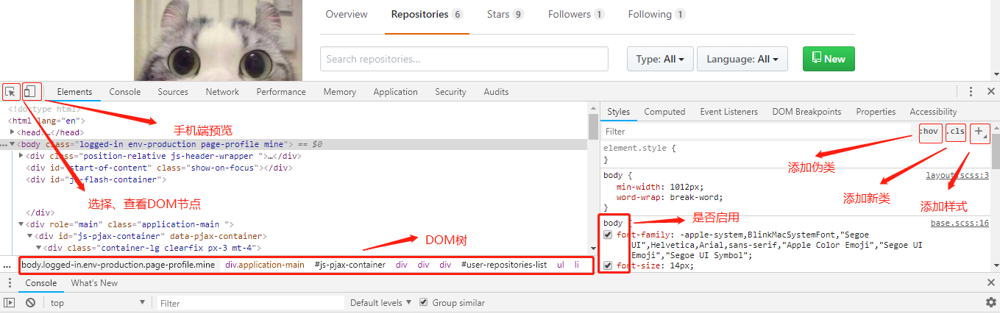
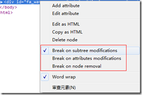

# Web-Developer-Tools-usage

>Chrome浏览器调试工具、火狐浏览器的Firebug、IE的开发人员工具等的使用方法.

### Chrome浏览器调试工具

Chrome当前版本一共有9个功能子集，每一个图标点击后都会打开相应的调试面板，帮助你获取各种不同的信息，如 DOM 树、资源占用情况、页面相关的脚本等。通过 Ctrl+[ 和 Ctrl+] 键，可以在这些项之间进行切换。常用的五个模块为Element、Console、Network、Source、Audits，每个模块及其主要功能为：

- Elements 标签页： 用于查看和编辑当前页面中的 HTML 和 CSS 元素。

- Console 标签页：用于显示脚本中所输出的调试信息，或运行测试脚本等。

- Network 标签页：用于查看 HTTP 请求的详细信息，如请求头、响应头及返回内容等。

- Sources 标签页：用于查看和调试当前页面所加载的脚本的源文件。

- Audits 标签页：分析页面加载的过程，进而提供减少页面加载时间、提升响应速度的方案，用于优化前端页面，加速网页加载速度等。

#### 一、Elements

在元素（Elements）面板中，可以看到整个页面的 DOM 树结构和每个元素的所有属性（即html和css），同时也可以实时地修改这些元素及其属性，并可以实时看到修改后的效果。

1. styles

点击点击页面上的元素，显示选中元素的HTML代码和样式；

- 编辑HTML：在工具窗口左侧是html代码，可通过双击修改现有标签的属性值，也可选中html代码片段右击选择“Edit as HTML”进行html代码的修改；

- 编辑属性：在工具窗口右侧显示的是被选元素的样式信息，可以通过双击现有属性来修改该元素的 style 属性或应用的某个选择器中的属性值，也可以通过取消勾选的方式去掉一些属性，同时页面实时变化。

- 添加属性：鼠标双击您所想修改的元素的选择器的空白部分，即可添加属性。添加任何属性都必须以分号结束。你也可以直接点击+号，添加新选择器并进行属性操作。

- 可以直接在盒模型上更改margin和padding。

- 搜索功能：当工具面板获得焦点后，快捷键ctrl+f会打开搜索框，键入元素关键字进行搜索。

- 你还可以对某个元素进行监听，在JS对元素的属性或者HTML进行修改的时候，直接触发断点，跳转到对改元素进行修改的JS代码处：

